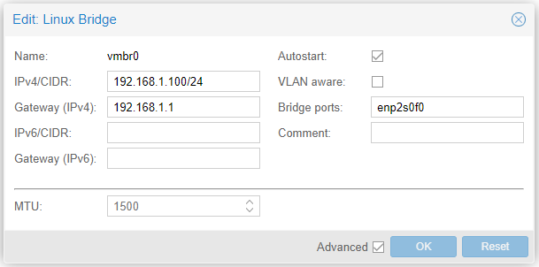
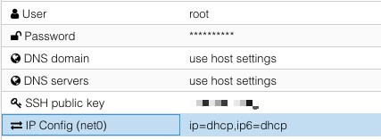

## Install Proxmox VE

The first step is to install [Proxmox VE](https://www.proxmox.com/en/downloads/category/iso-images-pve) on a bare-metal machine. The Proxmox VE ISO image is available [here](https://www.proxmox.com/en/downloads/category/iso-images-pve). 

However, the ISO image only supports installation using the entire disk. Thus, we first install Debian 11 (bullseye) and then install Proxmox as a software on Debian. In this way, we can customize the partition rather than use the entire disk.

### 1. Ventoy

We use [Ventoy](https://www.ventoy.net/en/download.html), a new Bootable USB Solution, to boot the Debian ISO image (or Proxmox VE). Using Ventoy, we can boot multiple ISO images without formatting the USB disk.

Ventoy supports both x86 Legacy BIOS and UEFI Secure Boot.

### 2. Proxmox

After installing Debian 11, we follow official instructions [here](https://pve.proxmox.com/wiki/Install_Proxmox_VE_on_Debian_11_Bullseye) to install Proxmox VE.

#### 2.1 Create a bridge network

The bridge network interface allows VMs inside Proxmox to get IP from the router using DHCP.



#### 2.2 Ubuntu Cloud Image

We create the k3s cluster using Ubuntu VMs cloned from a template. The template can be created with Ubuntu Cloud Image.

```
# Log into Proxmox

# Create Ubuntu Cloud Image
$ curl -O http://cloud-images.ubuntu.com/releases/focal/release/ubuntu-20.04-server-cloudimg-amd64.img
$ sudo apt install libguestfs-tools -y
$ sudo virt-customize -a ubuntu-20.04-server-cloudimg-amd64.img --install qemu-guest-agent
$ sudo virt-customize -a ubuntu-20.04-server-cloudimg-amd64.img --install qemu-guest-agent --truncate /etc/machine-id 

# Create a template VM
$ qm create 9001 \
    --name ubuntu-20.04-cloud-init --numa 0 --ostype l26 \
    --cpu cputype=host --cores 1 --sockets 1 \
    --memory 1024  \
    --net0 virtio,bridge=vmbr0
$ qm importdisk 9001 ubuntu-20.04-server-cloudimg-amd64.img local-lvm
$ qm set 9001 --scsihw virtio-scsi-pci --scsi0 local-lvm:vm-9001-disk-0
$ qm set 9001 --ide2 local-lvm:cloudinit
$ qm set 9001 --boot c --bootdisk scsi0
$ qm set 9001 --serial0 socket --vga serial0
$ qm set 9001 --agent enabled=1
```

Then, you can set up cloud init from web interface (e.g. ssh public key):



Lastly, create the template.

```
$ qm template 9001
```

We can create three Ubuntu VMs from the template:

```
$ qm clone 9000 100 --name Ubuntu-20.04-master --full
$ qm clone 9000 101 --name Ubuntu-20.04-worker1 --full
$ qm clone 9000 102 --name Ubuntu-20.04-worker2 --full
```


Remember to change the hostname for each Ubuntu VM because the k3s cluster won't accept nodes with duplicated hostnames.

```
$ ssh ubuntu@192.168.1.130
$ sudo hostnamectl set-hostname master

$ ssh ubuntu@192.168.1.114
$ sudo hostnamectl set-hostname worker1

$ ssh ubuntu@192.168.1.115
$ sudo hostnamectl set-hostname worker2
```

Now, we are ready to create a k3s cluster.
